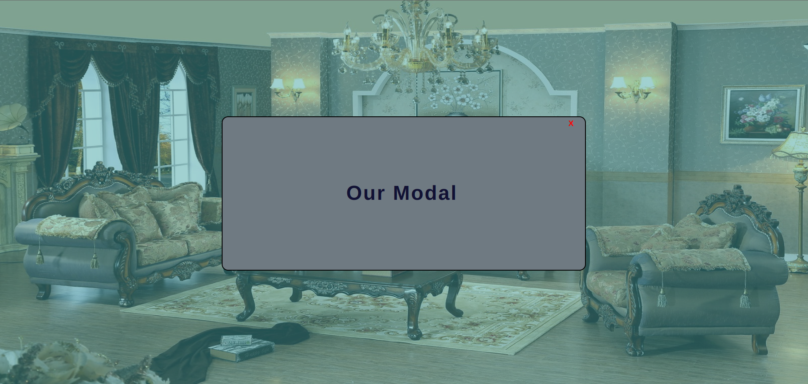

# MODAL PROJECT

## FRONTEND PRACTICE PROJECT NO: 6

1. I used Javascript, Jquery, HTML, CSS to practice my skills.

2. When we click to the button it filters the background and creates a new div elements inside modal div and a close button which works.

3. There is no modal image because it is just for practicing.
